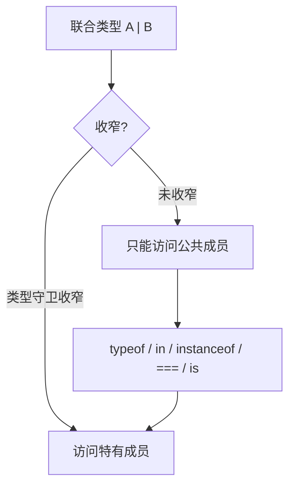

# TypeScript 进阶类型 · 模块总结

> 本文包含 Mermaid 图表，推荐在支持 Mermaid 渲染的 Markdown 阅读器中查看（如 VS Code、Obsidian、Typora）。

## 模块概览

本模块覆盖三个进阶类型机制：联合/交叉（类型运算）、类型收窄（控制流推断）、映射类型/索引签名（类型层面的变换与描述）。它们共同构成"用类型精确表达业务约束"的工具箱，也是模块 3 泛型与类型体操的前置基础。

## 核心知识点清单

### 2.1 联合类型 & 交叉类型
- 联合 `A | B`：值是 A 或 B 之一（值并集），收窄前只能访问公共成员（成员交集）
- 交叉 `A & B`：值同时具备 A 和 B（值交集），成员取并集
- 交叉同名属性类型取交集，冲突（`string & number`）坍缩为 `never`
- 字面量联合 `'a' | 'b'` 常替代枚举

### 2.2 类型守卫 & 类型收窄
- 收窄：编译器沿控制流把宽类型推导成精确子类型
- 手段：typeof（原始）/ in（对象结构）/ instanceof（类实例）/ 相等性-switch / 自定义类型谓词 `x is T`
- 判别联合：同名字面量判别字段 + `===` 收窄最稳
- default 赋 `never` 做穷尽检查

### 2.3 映射类型 & 索引签名
- 索引签名 `[key: string]: T`：任意键对象，值类型须兼容所有显式属性
- `keyof T`：取键的字面量联合
- 映射类型 `[K in keyof T]: ...`：遍历键生成新类型，可 `+/-` `readonly`、`?`
- `Partial`/`Readonly`/`Record` 底层即映射类型

## 关键流程图：联合类型从定义到安全访问



## 关键对比表

| 机制 | 运算符/语法 | 值集合 | 成员可达性 |
|------|------------|--------|-----------|
| 联合 | `A \| B` | 并集（A 或 B） | 交集（公共成员） |
| 交叉 | `A & B` | 交集（A 且 B） | 并集（全部成员） |
| 索引签名 | `[key:string]: T` | 任意键 | 单一值类型 |
| 映射类型 | `[K in keyof T]` | 固定键集合 | 按 T[K] 变换 |

## 关键代码片段

```typescript
// 判别联合 + 收窄（最推荐的对象联合处理模式）
interface Success { ok: true;  data: string; }
interface Failure { ok: false; error: string; }
type Result = Success | Failure;

function handle(r: Result) {
  if (r.ok === true) return r.data;   // r: Success
  return r.error;                      // r: Failure
}

// 手写映射类型（内置 Partial/Readonly 的本质）
type MyPartial<T>  = { [K in keyof T]?: T[K] };
type MyReadonly<T> = { readonly [K in keyof T]: T[K] };

// 穷尽检查（never 兜底）
type Status = 'active' | 'inactive' | 'pending';
function handle(s: Status) {
  switch (s) {
    case 'active':   return 1;
    case 'inactive': return 0;
    case 'pending':  return -1;
    default:
      const x: never = s;  // 漏 case 即报错
      return x;
  }
}
```

## 易错点汇总（基于你的实际考核）

1. **联合 vs 交叉的成员可达性反转**（2.1）：联合值并集但成员交集；交叉值交集但成员并集。
2. **交叉同名冲突变 never**（2.1）：`string & number = never`，赋任何值都报错。
3. **真值收窄 vs 相等性收窄**（2.2）：`if(r.ok)` 对布尔判别符有效，但对字符串/数字字面量判别符无效，须用 `===`/switch。
4. **in 的两种含义**（2.2 vs 2.3）：类型守卫 `in`（运行时判断属性有无）vs 映射类型 `in`（类型层遍历键）。
5. **判别字段 vs 业务字段**（2.2）：用 `ok` 这类判别字段收窄比 `in 'data'` 检查业务字段更稳，业务字段变动会让 in 失效（else 收窄 never）。
6. **索引签名兼容性**（2.3）：索引签名值类型必须兼容所有显式属性，否则报错（修复：拓宽为 `string | number`）。
7. **索引签名 vs 映射类型**（2.3）：前者键任意（开放），后者键固定（封闭）。

## 个性化点评

**强项**
- 类型运算的核心直觉建立得不错（联合=选择，交叉=叠加）
- 判别联合理解到位，能区分判别字段与业务字段的可维护性差异
- 映射类型语法和 keyof 的作用掌握扎实

**需留意**
- 答题偶有"漏答子问"倾向（2.1 任务3、2.3 任务1）——审题时把每个问号都标记一下，避免遗漏
- 个别表述会混淆"键"和"值"（2.3 任务3）——描述类型时明确区分"键的类型"和"值的类型"

**复习建议**
- 高频：看 `distilled/topic6/7/8` 三份蒸馏，合上默想核心机制，想不出再翻对应 raw-document
- 重点回看：2.2 真值收窄 vs 相等性收窄（你这次的点拨点）、2.1 的 never 赋值行为
- 明天（08-09）1.1/1.2 到期复习，届时快速过一遍

## 下一步

模块 3「泛型与类型体操」是本主题的高潮，会用到本模块的联合、keyof、映射类型。建议休息一下再继续——泛型需要清醒的头脑。
