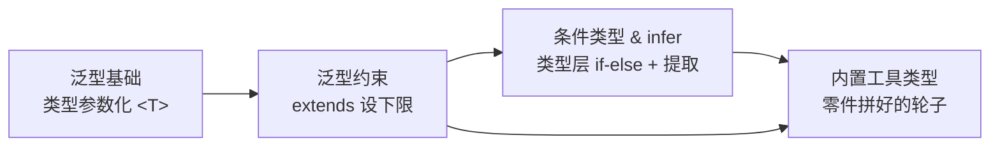

> 本文包含 Mermaid 图表，推荐在支持 Mermaid 渲染的 Markdown 阅读器中查看（如 VS Code、Obsidian、Typora）。

# 模块 3：泛型与类型体操 — 阶段总结

> 完成时间：2026-08-10 · 节点 3.1-3.4 全部通过 · 🎉 TypeScript 主题 12/12 完成

## 核心知识图谱



## 四节核心串联

泛型的演进是一条线：**从「能复用」→「能约束」→「能判断提取」→「现成工具」**。

| 节点 | 解决的问题 | 核心机制 | 关键代码 |
|------|----------|---------|---------|
| 3.1 泛型基础 | any 擦除类型关系 | `<T>` 类型参数，调用时锁定 | `function id<T>(x:T):T` |
| 3.2 泛型约束 | 无约束 T 用不了成员 | extends 设形状下限，保留具体类型 | `<T extends HasLength>`, `K extends keyof T` |
| 3.3 条件类型&infer | 不能按形态分支/提取 | `T extends U?X:Y` + `infer R` | `T extends Promise<infer R>?R:T` |
| 3.4 工具类型 | 常用变换反复手写 | 上面三者的组合轮子 | Partial / Pick / Record / ReturnType |

## 底层零件 → 工具类型对应

```
泛型 <T>  ─┐
映射类型   ─┼──→ Partial / Required / Readonly / Pick / Record
keyof     ─┘
条件类型+infer ──→ ReturnType / Parameters
分布性条件类型 ──→ Exclude / Extract
```

## 关键代码片段

**泛型 + 约束 + keyof（安全取值）**
```ts
function getValue<T extends object, K extends keyof T>(obj: T, key: K): T[K] {
  return obj[key]   // key 传错编译期报错，返回值精确到值类型
}
```

**条件类型 + infer（解包 Promise）**
```ts
type Unwrap<T> = T extends Promise<infer R> ? R : T
```

**自造工具类型**
```ts
type MyPartial<T> = { [K in keyof T]?: T[K] }
type MyReturnType<T> = T extends (...args: any[]) => infer R ? R : never
```

## 个性化点评

### 🌟 强项
- **泛型核心机制扎实**：类型参数化、T 在一次调用里锁定、入参→返回类型关系保留，理解到位（3.1/3.2 代码一次写对）。
- **条件类型 + infer 写法灵敏**：Unwrap、MyParameters 都一次写对，infer 提取什么答得准。
- **工具类型实战应用熟练**：Pick/Omit/Partial 用法与场景解释清晰。

### ⚠️ 易错点汇总（复习重点）
1. **对象字面量分隔符**（3.1）：属性间用 `,` 不是 `;`。interface 里 `;`/`,` 都行，对象字面量（值）只能 `,`。
2. **extends 的「新增能力」**（3.2）：相比*无约束泛型*，extends 新增「能用成员」；相比*基类型*，extends 新增「保留具体类型」。别混。
3. **联合类型不坍缩**（3.3，属 2.1）：`string[] | number[]` 是联合（满足其一），不等于 `[]`。`|` 是二选一，不是取交集。

### 📅 复习建议
- **明日 08-11 到期**：2.1 / 2.2 / 2.3 — 重点重测联合类型语义（`string[]|number[]` 问题）。
- **08-13 到期**：3.1 / 3.2 — 重点重测 extends 约束的「新增能力」区分。
- **08-17 到期**：1.1 / 1.2 / 1.3（Lv2）。
- **复习方法**：看 `distilled/topic9-12` 标题默想，想不出再翻 `raw-document`。

## 阶段成果
- 4 个节点全部通过，累计 attempts=5（3.1×1 + 3.2×2 + 3.3×1 + 3.4×1）
- 生成 4 个蒸馏复习卡：`distilled/topic9-12`
- 🎉 TypeScript 主题 12/12 节点全部完成
